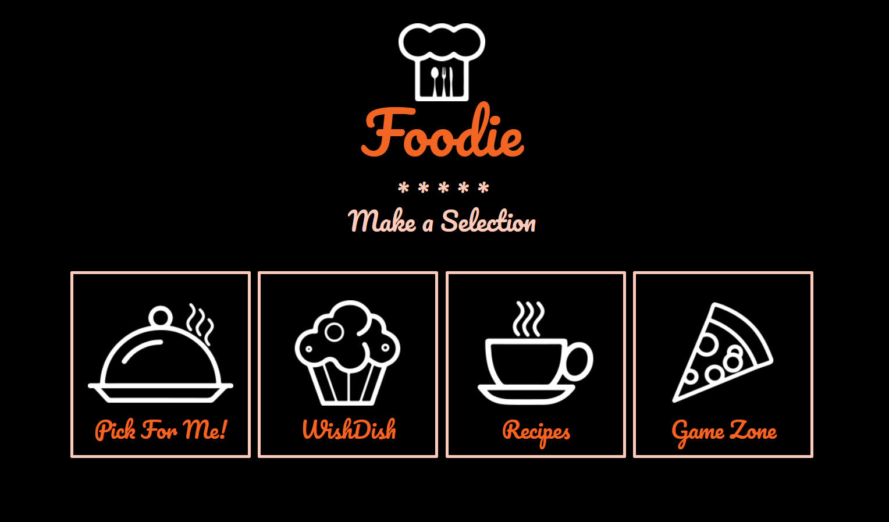
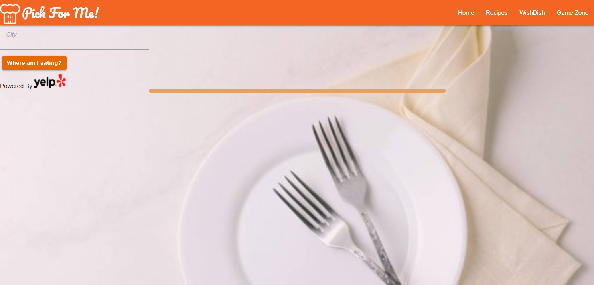
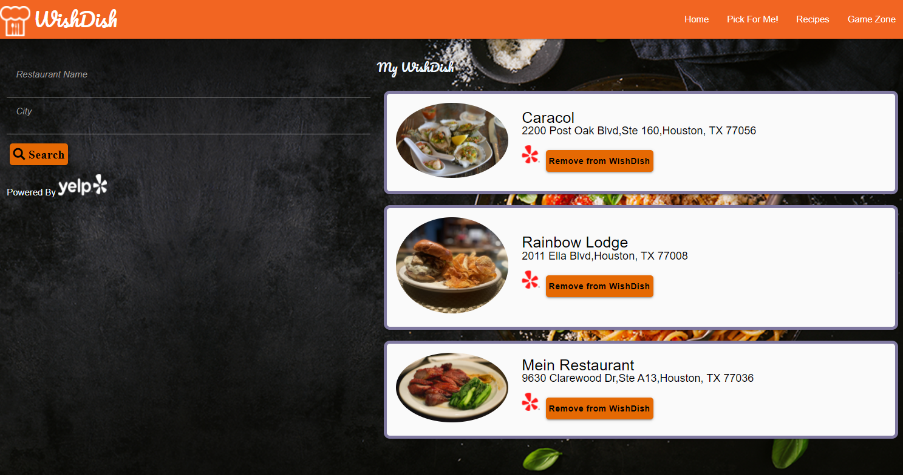
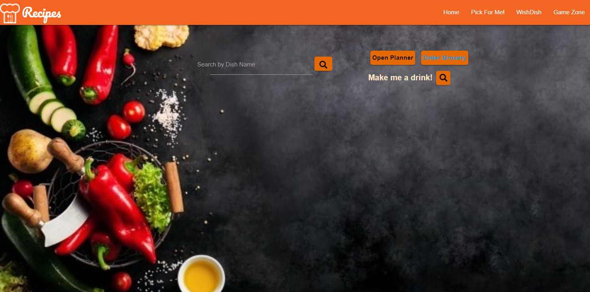
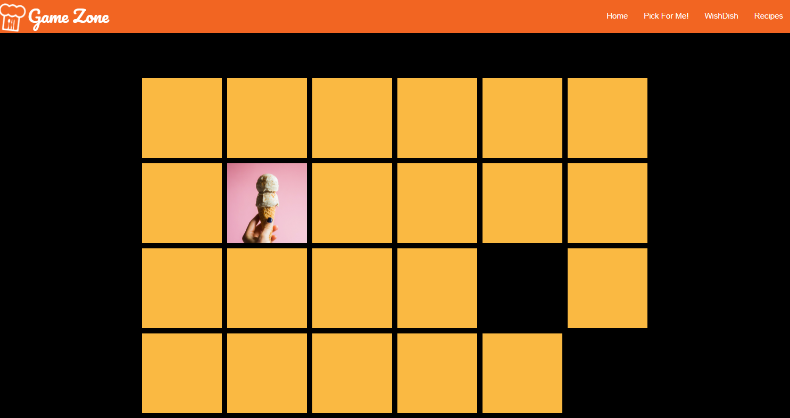

# GroupProject1

Foodie is an interactive one-stop shop page for food lovers that fulfils their food needs.

# Description

Foodie is an interactive one-stop shop where user is provided with many options to choose from all at one place.

# Index Page: (Welcome page)

- Food images carousel
- User clicks Enter button and will be directed to the home page.

# Home Page:

- User is asked to make a selection to go a particular page.

# Pick For Me! Page:

- User is indecisive about where to go for dinner, so, after providing their location, will be given a random restaurant listing to check out.

# WishDish Page:

- User has heard about a restaurant that they want to go to at a future date. They search for the restaurant by name and location, and then add it to their WishDish so that they have it handy next time they need to pick a restaurant.
  -If the user has gone to the restaurant, or is no longer interested in going there, they can delete the entry from the list.

# Recipes Page:

- User can search a recipe by dish name.
- User can choose an option between viewing a recipe with ingredients, watching a video of that recipe or saving that recipe in a meal planner for future reference.
- User clicks Make me a drink search button for a randomly chosen cocktail along with save to calendar option for future reference.
- User clicks meal planner button and a modal will pop up. User can view the saved links and add/clear notes.
- User clicks order grocery button and will be taken to a walmart grocery page.

# Game Zone: (Memory Game)

- When the game starts, all tiles are turned face down.
- The player then flips over two cards, selecting them by clicking on them.
- If the two tiles have the same image, they are removed from the board. If not, they should be flipped face down again after a short delay.

## Technologies Used

- HTML
- CSS
- JavaScript
- jQuery
- Third Party APIs (Yelp, The Meal DB, The Cocktail DB)
- Materialize
- Google Fonts

## Link of Deployed Application

https://nskidmore7.github.io/GroupProject1/

## Powerpoint Presentation Link

https://docs.google.com/presentation/d/13ur5k5cG2PM53hANxAa-yVU7fSaIGSOb/edit?usp=sharing&ouid=110846898095699650282&rtpof=true&sd=true

## Screenshots of Deployed Application

